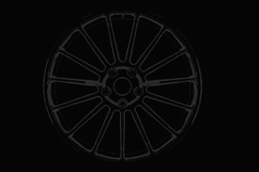
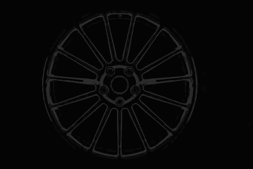
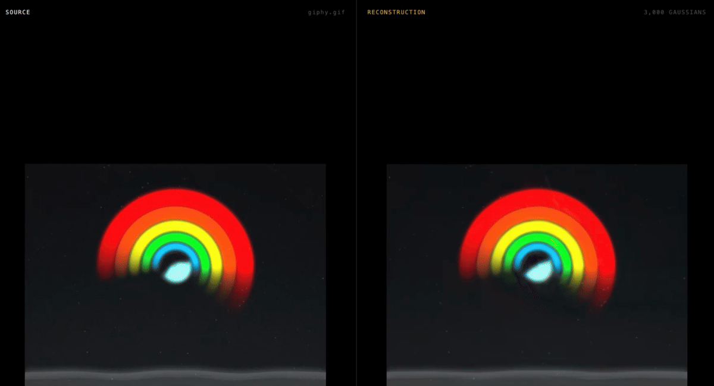

# neo

Neo is an inverse visual compiler. A video supplies a finite set of samples
`I(x,y,t_k)`; Neo tries to compile those pixels into an executable,
inspectable, and editable continuous visual program `I(x,y,t)`.

“Recovering movement as math” is the research hypothesis being tested, not a
result assumed in advance. The still-image work below is groundwork. A frame
first has to become a few thousand candidate primitives rather than a pixel
grid before it makes sense to ask whether those primitives persist and how
they move. Image fidelity and file size are measurements, not the deliverable,
and this is not primarily a compression project.

## The idea

Pixels are samples of a visual signal. A finite set of samples does not
determine a unique continuous source: many programs can agree at every observed
pixel and disagree between them. Neo therefore searches for a useful
description — shapes, extents, colours, and temporal functions — rather than
claiming to reveal the one true scene hidden behind the pixels.

The first test of that groundwork is whether the fitted model can be evaluated
at a different spatial sampling density and still produce coherent,
resolution-independent structure. Any structure beyond the source sampling is
**implied by the recovered model**, not newly verified source detail. A
conventional raster copy must be resampled to change resolution; vector,
implicit, and other continuous representations can also be re-evaluated. The
important distinction is the representation, not whether it is compressed.

For video, the stronger hypothesis is that frames can share a persistent
description whose parameters change as compact functions of `t`. If that holds,
movement stops being only a difference between two grids of numbers and becomes
part of an executable program.

## What would count as recovery

There are three different claims, and they should not be collapsed:

1. **Sample reproduction.** Evaluate the program at the observed `t_k` and
   reproduce the sampled frames.
2. **Unseen-time behaviour.** Evaluate it at times not used for fitting and
   match withheld source frames where ground truth exists; beyond those times,
   behave coherently rather than merely bend through the samples.
3. **Interventional meaning.** Edit time controls, functions, or primitives and
   get a predictable change that remains meaningful.

The current evidence is strongest at level 1. Level 2 is explicitly unsettled:
a held-out wheel experiment gets worse as the temporal basis becomes more
expressive, and 88 unsampled frames of the longer test clip remain unscored.
Level 3 is the intended destination, not a completed claim.

Frame reproduction alone proves neither true physical motion nor semantic
primitive identity. The synthetic translation and supplied rigid-rotation
experiments below have exact motion truth; the real clips do not. Keeping row
`i` stable is an executable identity contract, but it does not by itself prove
that row `i` is the same physical or semantic thing throughout the scene.

That is the direction. It is being built one verified step at a time, and what
follows is every step that currently works.

Requires a recent Rust toolchain and a GPU with Metal, Vulkan, or DX12.

```bash
cd mathset && cargo build --release
```

---

## 1 · An image made of forty-five numbers

**2026-07-26**

[`sets/five.mathset`](mathset/sets/five.mathset) is a text file containing five
rows of nine numbers. Open it — the whole thing fits on a screen. It is the
entire image.

```bash
cd mathset && cargo run --release -- render sets/five.mathset out.png
```


Each row is one soft ellipse:

```
x     y     sx    sy    theta       r     g     b     a
0.38  0.42  0.220 0.045 -0.5235988  0.95  0.55  0.15  0.85
```

Where it is, how long and how thin, how tilted, what colour, how opaque. That
row is the orange stroke.

Worth doing: change a number and re-render. Set `sy` to `0.15` and the stroke
fattens. Set `theta` to `0` and it lies flat. Move the last row to the top of
the list and the white dot vanishes behind the blue — because the list is a
paint order, not a set.

**The decoder never sees a source image.** There is nothing to copy from. The
picture is computed from those forty-five numbers and nothing else.

---

## 2 · The numbers have no resolution

**2026-07-26**

Same file. Render it eight times larger:

```bash
cd mathset && cargo run --release -- render sets/five.mathset big.png --scale 8
```

4096×4096. Zoom all the way into any edge — it is clean.


Left is the honest limit of a picture: the 512 render with its pixels blown up
ten times. Right is the same region of the same file, evaluated at 4096. The
curve on the right was never stored anywhere.

There was no 512×512 raster inside the file to enlarge; there were five
equations, and they were evaluated at sixty-four times as many points. The
4096 render exposes structure implied by those equations. It does **not** prove
that the original source contained matching sub-pixel ground-truth detail.

A conventional raster copy has to be resampled to make a larger raster. A
continuous representation — including vector graphics, implicit functions, or
this mathset — can instead be evaluated at the requested coordinates. This
experiment verifies that property of the model.

To confirm it is not an illusion, the 8× render can be shrunk back down and
compared against a native 512×512 render:

```
8x downsampled back and compared: 60.86 dB
```

The same description, sampled at two densities, agreeing.

---

## 3 · One number from soft to hard

**2026-07-26**

A Gaussian cannot make an edge — its falloff is smooth everywhere. Real images
are full of edges, so the primitive carries a shape exponent `β` that controls
how abruptly it ends.

```bash
cd mathset && cargo run --release -- render sets/beta.mathset out.png --scale 3
```


Five primitives, identical in position, size, and colour. Only `β` differs —
`0.5, 1, 2, 4, 12` from left to right. They run from a long-tailed blur through
an ordinary Gaussian to a nearly hard-edged disc: a **13× sharper** transition
across that range, for one extra number per primitive.

Note how far the leftmost one reaches — at `β = 0.5` the tails extend twelve
standard deviations and visibly wash into its neighbour. That is the cost of a
soft primitive, and the reason `β < 1` is rarely the right tool. Detail should
come from more primitives, not longer tails.

The point is not that hard edges are better. It is that the fitter gets to
choose, per primitive, so soft skin and a crisp sleeve cost exactly the same.

---

## 4 · The image is a consequence of the file

**2026-07-26**

A renderer producing a plausible picture proves very little. So there are two
decoders, sharing no code:

- Rust and WGSL, running `f32` on the GPU, with hardware blending
- Python standard library, running `f64` on the CPU, written from the written
  spec alone

```bash
./mathset/tools/verify.sh
```

```
── sets/five.mathset
    max channel difference : 2 / 255
    psnr                   : 56.05 dB

── sets/beta.mathset
    psnr                   : 57.66 dB
```

Different language, different precision, different hardware, different blending
path — same image, to within a rounding error of one or two parts in 255.

That agreement is the real claim. The picture is not an artifact of a
particular renderer or a particular machine. It is a consequence of the
numbers, and anyone with the file can recompute it.

There is no image for this section on purpose. Two matching pictures would
prove less than the numbers do.

---

## 5 · A photograph, written down as math

**2026-07-26**

The first four sections used sets written by hand. This one is read off a real
photograph.

```bash
cd mathset && cargo run --release -- fit ../assets/whiterabbit.jpg out.mathset --preview out.png
```

3.4 seconds. **24,886 primitives, 30.86 dB.**


That number is measured the hard way: the emitted file is reloaded from disk
and decoded by the ordinary decoder — the one that has never seen the
photograph — and *that* is compared against the source. Nothing the fitter
believes about its own canvas is taken on trust.

Open the output. It is the same format as the five-line file in section 1,
just longer. Every row is still nine or ten numbers describing one ellipse,
still in normalized coordinates, still with no pixel anywhere in it. Which
means:

```bash
cd mathset && cargo run --release -- render out.mathset big.png --scale 4
```

The photograph model now renders at 1804×2044 — four times the resolution it
was fitted at. The primitives were re-evaluated at the finer sampling, and
edges that were two pixels wide in the source become smooth model-implied
curves. This demonstrates resolution-independent evaluation; it does not
recover unobserved source detail for which there is no ground truth.


The kept fits and their numbers live in [fits/](fits/).

**What is honestly wrong with this result:** 24,886 primitives for 230,461
pixels is one primitive per nine pixels. That is too dense to call a
description of the image. The cause is structural — greedy placement can never
adjust a primitive after placing it, so the only way to fix an error is to
stack another primitive over it, and the count inflates without the
description improving. See
[docs/fitting.md](docs/fitting.md#the-honest-limitation).

The number to watch is not the dB but the dB *per primitive* — which is what
section 7 goes after.

---

## 6 · Watching it assemble

**2026-07-26**

The set is an *ordered* sequence — first primitive painted first. Which means
every prefix of the file is itself a complete, valid set. Drawing the first
three primitives is not a partial render; it is a whole, smaller description.

```bash
cd mathset && cargo run --release -- render out.mathset build.png --steps 40
```


Forty frames, from a handful of ellipses to the finished image, spaced
geometrically because the first few primitives carry far more of the picture
than the last few thousand. A single frame at any depth:

```bash
cd mathset && cargo run --release -- render out.mathset one.png --limit 60
```

Sixty rows in, the photograph is already recognisable. That is the clearest
statement of what a math set is: not a compressed picture, but a description
that is *complete at every length*, and merely gets more specific.

---

## 7 · Moving the primitives instead of adding more

**2026-07-26**

Section 5 ended with a complaint: 24,886 primitives for 230,461 pixels is too
dense to call a description. The cause was that greedy placement can never
adjust a primitive once it is down, so its only way to fix an error is to
stack another one on top.

Every parameter of the primitive is differentiable — position, extents,
rotation, colour, opacity, and `β`. So instead of adding primitives, move the
ones that already exist:

```bash
cd mathset && cargo run --release -- refine ../assets/whiterabbit.jpg in.mathset out.mathset --iters 900
```

Nothing is added or removed. The same rows, with better numbers in them.


Identical count, **+5.5 dB**. And the result that actually matters:


**6.2× fewer primitives for the same image** — one per 58 pixels instead of
one per 9. The file goes from 2.1 MB to 358 KB, but the size is a side effect.
The point is that the set has stopped patching itself and started describing
something.

The derivatives are closed form — about eighty lines of WGSL, no automatic
differentiation. The awkward part is that a primitive's influence on the final
image is scaled by everything painted *over* it, `Π(1−α)`, which is only known
after the later primitives are seen. That forces a backward walk through the
composite. [docs/refining.md](docs/refining.md) has the full chain.

**A wrong gradient is the quietest possible bug** — the image still improves,
because the other nine parameters compensate, so no fidelity number would ever
reveal it. Every derivative is therefore checked against a central finite
difference of the same forward model, implemented separately in `f64` on the
CPU:

```bash
cd mathset && cargo run --release -- gradcheck ../assets/whiterabbit.jpg tiny.mathset
```

```
 param         analytic      finite diff    rel err
     x        -246.8766        -245.3877    0.00603
 theta          15.6117          15.8483    0.01493
  beta          88.3083          88.5451    0.00267
       ...  worst relative error 0.02316 — gradients agree
```

**What is still wrong:** the count is fixed. Refinement cannot add a primitive
where the image needs one, or delete one that has become useless. That is what
section 8 goes after.

---

## 8 · How few is enough

**2026-07-26**

Refinement can move the primitives that exist but not change how many there
are. It cannot add one where the image needs it, and it cannot drop one that
has become useless. Both are available for almost nothing, because the
backward walk already knows what every primitive is worth.

Removing a primitive shifts the image by a quantity the walk already computes,
so the exact loss it earns its place with falls out with no extra pass:

```
dC     = T_k · a_k · ( c_k - C_{k-1} )
worth  = dot(dC, dC) - dot(dC, dL/dC_N)
```

Positive means it pays for itself. Zero means it contributes nothing. Negative
means removing it would *improve* the image. And a primitive whose accumulated
positional gradient is large is being pulled in conflicting directions — one
primitive asked to cover two things — so it splits in two.

```bash
cd mathset && cargo run --release -- refine ../assets/whiterabbit.jpg in.mathset out.mathset \
  --iters 900 --adapt --count 2500
```


**10.5× fewer primitives than placement alone, for a slightly better image.**

| | primitives | round trip | pixels per primitive |
|---|---:|---:|---:|
| placed only | 24,886 | 30.86 dB | 9 |
| placed + refined | 4,000 | 30.99 dB | 58 |
| **placed + refined + adapted** | **2,381** | **31.12 dB** | **97** |


The worth score is checked against reality the same way the gradients are —
predicted loss increase against the loss actually measured after removing the
primitive. Worst relative error **0.1%** across four orders of magnitude. It is
exact, not a heuristic that happens to work.

This matters more than the fidelity. A set with a primitive every nine pixels
is pixels in disguise: it would reconstruct perfectly and be useless for
everything downstream, because nothing in it corresponds to anything in the
image. A primitive every 97 pixels is starting to be a description — and
whether these primitives are stable enough to *persist* from one frame to the
next is the question the whole project turns on.

**What is still missing:** splitting is the only way to add. A primitive can
divide, but nothing introduces one into a region that has none, so anything
placement missed entirely stays missed.
[docs/parsimony.md](docs/parsimony.md) has the method and the failure modes.

---

## 9 · The image can be right while the movement is wrong

**2026-07-27**

Warm-start frame B from frame A's 2,381 primitives, refine the same rows, and
the reconstruction reaches **30.90 dB** — essentially the same fidelity as
frame A. It looks like persistence worked.

It did not. Frame B was synthesized by moving one patch exactly 25.55 px, so
the primitive displacement can be checked against a known answer. Inside that
patch the mean recovered displacement was **−0.36 px**, median position error
was **25.69 px**, and only **6.8%** of primitives moved far enough to be called
moved. They stayed where they were and changed colour instead.

| true shift | mean recovered displacement | median error |
|---:|---:|---:|
| 2.0 px | +1.25 px | 0.89 px |
| 5.1 px | +1.77 px | 3.72 px |
| 10.2 px | +0.88 px | 9.42 px |
| 25.6 px | −0.36 px | 25.69 px |

The capture radius is about one primitive's `σ`: position gradients are local,
so a primitive cannot feel content that moved much farther than its own
extent. A plain 1/8→1/4→1/2→full image pyramid does not change that ratio in
normalized coordinates; measured end to end, it still recovered only
**+0.78 px** of the 25.55 px shift.

Moving a group as one unit does cross the gap. Comparing the two source frames
at 128 px finds one changed region containing all 295 true members plus 19
boundary extras. Sub-pixel frame correspondence then recovers **+25.95 px**
without reading the truth. After ordinary refinement, all **295/295** true
members still track the move, median error is **0.66 px**, and **1.1%** of
outside primitives are false positives.

The actual endpoint sets are kept, not just their plots:

| file | role |
|---|---|
| [`fits/whiterabbit-20260727-motion-a.mathset`](fits/whiterabbit-20260727-motion-a.mathset) | original positions |
| [`fits/whiterabbit-20260727-motion-b.mathset`](fits/whiterabbit-20260727-motion-b.mathset) | recovered second positions; only `x/y` differ |
| [`fits/whiterabbit-20260727-motion-b-refined.mathset`](fits/whiterabbit-20260727-motion-b-refined.mathset) | second frame after 200 refinement iterations |

These are ordinary decoder renders of the two saved movement endpoints:

| A · original positions | B · recovered second positions |
|---|---|
|  |  |

A is the 2,381-primitive set fitted and adapted against the synthetic
harness's first frame. `track-change` compared source frames A and B, found the
changed region and translated 314 rows of that same ordered set by 25.95 px to
produce the saved mathset B above. No second fit or row matching is hidden
between these images.

For primitive `i`, the movement between A and B is:

```text
x_i(t) = x_i(A) + t · (x_i(B) - x_i(A))
y_i(t) = y_i(A) + t · (y_i(B) - y_i(A))     0 ≤ t ≤ 1
```

Evaluate that transition into a real intermediate `.mathset`, then render it:

```bash
cd mathset
cargo run --release -- transition \
  ../fits/whiterabbit-20260727-motion-a.mathset \
  ../fits/whiterabbit-20260727-motion-b.mathset \
  target/motion-half.mathset --t 0.5
cargo run --release -- render target/motion-half.mathset target/motion-half.png
```

`transition` requires identical ordered primitives and rejects changes to
scale, rotation, colour, opacity, or shape. This example therefore evaluates
recovered movement rather than cross-fading two unrelated fits.

```bash
cd mathset
cargo run --release -- track-change target/mo/a.png target/mo/b.png \
  target/mo/A.mathset target/mo/grouped.mathset --levels 7
cargo run --release -- refine target/mo/b.png target/mo/grouped.mathset \
  target/mo/B.mathset --iters 200
python3 tools/persist.py target/mo/A.mathset target/mo/B.mathset target/mo/truth.json
```

Spatially separated regions are handled independently: a two-motion synthetic
test recovers both translations within **0.48–1.03 px**, with all 166 true
members moved and 1.4% outside false positives. Touching objects with different
motion and rotation or affine motion remain open. [docs/motion.md](docs/motion.md)
has the harness, failed pyramid, group searches, and exact boundary.

| independent warm start | coarse group move, then refinement |
|---|---|
|  |  |

---

## 10 · The real wheel GIF as one persistent timeline

**2026-07-27**

[`assets/wheel.gif`](assets/wheel.gif) has 13 frames at 80 ms each. A single
rigid transform of the crisp first frame was tested and rejected: it produced
an almost stationary wheel and had nothing to do with the visible blur
progression. That is not the deliverable.

The real result keeps one ordered set of **2,285 primitives** for the entire
GIF. Frame 0 is fitted once at 40.02 dB. Every following state is warm-started
from the preceding state and refined against the next real frame without
adding, deleting, or reordering a row. Position, extent, orientation, colour,
opacity, and edge softness are all allowed to evolve because all of them are
part of the motion visible in this clip.

That persistent row order is necessary for an executable trajectory, but it is
not sufficient evidence that each row tracks one physical surface point or
semantic part. Section 9 demonstrates exactly why good frame reconstruction
cannot settle that question.

| original GIF | recovered persistent-primitive timeline |
|---|---|
|  |  |

Every image on the right is an ordinary decoder render of its saved mathset.
The decoder never sees the GIF frame. Across all 13 states:

| measurement | result |
|---|---:|
| primitive count, every frame | **2,285** |
| mean decoded fidelity | **39.73 dB** |
| worst decoded fidelity | **38.16 dB** |
| median adjacent position step | **0.57–0.68 px** |
| 90th percentile adjacent position step | 1.32–1.47 px |

The kept states and their timing live together:

- [`fits/wheel-20260727-real/timeline.json`](fits/wheel-20260727-real/timeline.json)
- [`fits/wheel-20260727-real/`](fits/wheel-20260727-real/)

The timeline is executable at any `t`, not only at the 13 source times:

```bash
cd mathset
cargo run --release -- sample-timeline \
  ../fits/wheel-20260727-real/timeline.json \
  target/wheel-at-t.mathset --t 0.541666667
cargo run --release -- render \
  target/wheel-at-t.mathset target/wheel-at-t.png
```


Between two consecutive states, centres and opacity move linearly; orientation
takes the shortest angular path; positive extents and `β` interpolate in log
space; and colour interpolates in linear light. The midpoint is therefore
another explicit mathset, not a pixel cross-fade.

This is still keyframed rather than a compact temporal curve: thirteen states
are stored, and the sampler interpolates between them. It establishes the
prerequisite that one persistent ordered description can follow the real
animation instead of replaying a static rigid component. Section 11 replaces
the thirteen tables with a function.

---

## 11 · The whole clip as one formula

**2026-07-28**

Thirteen stored states are a description of an animation, but they are still a
table. Nothing in them says the wheel turns — the turning is implicit in the
differences between adjacent rows.

Every primitive parameter can instead be written as a function of `t`. This is
the readable evaluator recovered for a 120-frame test GIF:


The complete model is that evaluator **plus every recovered spatial and
temporal coefficient**. `Copy model` exports those tables and timing knots in
a portable capsule. Given that model, the decoder can evaluate a frame at any
`t` without the source GIF. The typeset equation alone is not enough; those
recovered numbers are the visual.

Two factorisations are stacked. Across primitives, each parameter is
represented by `R` shared modes with a per-primitive weight — when a wheel
turns, thousands of primitives move in a few coordinated ways, not thousands of
independent ways. Across time, a fully sampled periodic control uses a Fourier
series; an undersampled real clip uses parameter-aware local knots for each
shared mode. Positive extents and `β` are fitted in log space, colour in
linear light, and orientation along an unwrapped angular path, so that no
interpolation can produce an invalid primitive.

The periodic phase is `s(t) = 2π(ωt + τ)`; a knot program uses
`u(t) = wrap(ωt + τ)`. These are real program-level controls: changing `ω`
changes playback rate and its sign changes direction, while `τ` selects the
starting phase. For a periodic recovered program, `ω = -1` traverses the
recovered loop backwards. That is a valid intervention on the program; it is
not evidence that the program predicted physically correct unseen frames or a
true reverse process in the source world.

Applied to the 13 recovered wheel states — 2,285 primitives, one ordered
identity — and scored by rendering each evaluated program through the ordinary
decoder and comparing against the real GIF frame:

| model | coefficients | mean fidelity | worst frame |
|---|---:|---:|---:|
| 13 stored keyframe states | 296,050 | 39.73 dB | 38.16 dB |
| **one formula, `H`=6 `R`=12** | 298,610 | **39.73 dB** | **38.16 dB** |
| one formula, `H`=6 `R`=3 | 91,790 | 35.32 dB | 34.40 dB |
| one formula, `H`=6 `R`=1 | 45,830 | 33.96 dB | 31.64 dB |

At full rank the formula is a **near-lossless re-encoding** of the recovered
timeline, not merely a visual approximation. Relative coefficient RMS is
`3.62 × 10⁻⁸`; after rendering all 13 states, only 110 of 2,269,696 pixels
differ from the keyframe renders, and the largest RGB difference is 3/255.
Both source-fidelity measurements round to the same 39.73 dB mean and 38.16 dB
worst frame.

Two things that table does not say, and both matter.

**At full rank this is not compression.** 298,610 coefficients against 296,050
stored numbers — very slightly more. What changed is form, not size: a table
that must be interpolated became a function that can be evaluated. Size only
falls when `R` is truncated, and it is paid for in fidelity.

**Accuracy between samples is not established.** Fitting on 7 of the 13 states
and scoring the 6 real GIF frames that were withheld:

| harmonics | train fidelity | unseen fidelity | gap |
|---|---:|---:|---:|
| `H`=3 | 37.09 dB | 31.67 dB | **5.42 dB** |
| `H`=2 | 35.05 dB | 33.40 dB | 1.64 dB |

`H`=3 fits the frames it was given better than `H`=2 and reconstructs the ones
it was not given *worse*. Extra harmonics buy agreement with the samples by
bending between them. The honest reading is that the program reproduces the
sampled states to decoder precision, and is not yet trustworthy at unsampled
times.

The same extraction run against a local 120-frame GIF, fitted at 32
motion-aware anchors, produces the `H`=12 `R`=16 program above over 3,000
primitives. Here the source is on the left and the formula-driven
reconstruction is on the right:



The settled poses match closely. Fast-motion frames visibly streak in the
reconstruction in a way the source does not.

The 88 unanchored frames are now scored and alternated across the full timeline
into 44 validation and 44 test frames. A cosine `H=24 R=16` model chosen on
validation scored 31.94 dB mean / 28.32 dB worst on the then-untouched test
half, improving the original same-size Fourier result by 0.69 dB mean and
2.51 dB worst-frame fidelity.

A rank-24 local-knot program subsequently reached 32.63 dB mean, within
0.17 dB of full parameter-aware anchor interpolation, while replacing 960,000
stored anchor parameters with 757,712 coefficients. Because that family was
developed after inspecting this source's result, a new unrelated clip—not more
tuning on this one—is the next generalisation gate.

One boundary worth stating plainly: temporal extraction is not in the
`mathset` engine. The search runs in a local TypeScript playground; the
reported frames are evaluated and scored through the Rust/WGPU decoder. See
[docs/temporal.md](docs/temporal.md) for the derivation, the domain choices,
and the full measurements.

---

## The math

Everything above rests on one formula and one compositing rule. Both are short
enough to state here in full. [docs/math.md](docs/math.md) carries the
derivations.

### The primitive

A **primitive** is an ellipse with a soft edge. It has its own coordinate
frame, rotated by `θ` and scaled by `σx` and `σy`, and a point is measured in
that frame in units of standard deviations:

```
d = p − μ                            offset from the primitive's centre

u = (  d.x·cos θ + d.y·sin θ ) / σx
v = ( −d.x·sin θ + d.y·cos θ ) / σy
```

Undoing the rotation and dividing by the extents turns an ellipse in canvas
space into a circle in `(u, v)` space. The primitive's value there depends only
on distance from its centre:

```
G(u, v) = exp( −½ · (u² + v²)^β )
```

- `β = 1` is an ordinary **Gaussian** — the bell curve. Smooth everywhere,
  and therefore unable to produce a hard edge.
- `β > 1` squares the edge off. `β = 12` gives a transition **13× narrower**
  than a Gaussian's, approaching a hard-edged disc.
- `β < 1` gives longer tails than a Gaussian. Expensive, and rarely useful.

For `β = 1` this is the familiar multivariate Gaussian written differently.
With the **covariance matrix** `Σ = R(θ)·diag(σx², σy²)·R(θ)ᵀ`, it happens
that `u² + v² = dᵀΣ⁻¹d`, so `G(p) = exp(−½ dᵀΣ⁻¹d)`. The file stores
`(σx, σy, θ)` instead of `Σ` because each of those three numbers means
something on its own, and keeping the extents positive is a bound on one
number rather than a constraint on a matrix.

### Compositing

Each primitive's **opacity** at a point is its peak opacity `a` scaled by the
falloff, and primitives are laid down in file order with the standard *over*
operator:

```
α  = a · G(u, v)

C₀ = background
Cₖ = αₖ · cₖ + (1 − αₖ) · Cₖ₋₁
```

This does not commute — swapping two overlapping primitives changes the
result. That is why the file stores a **sequence**, not a set, and why
section 6 works at all.

### Colour

Colours are **stored** sRGB-encoded and **composited in linear light**.

*Linear light* means values proportional to actual photons; *sRGB* is the
non-linear encoding your screen and every image file use, which spends more
precision on darks because eyes do. Blending is only physically correct in
linear light, but a file should be legible, so the conversion happens at the
boundary:

```
srgb → linear:   c ≤ 0.04045   ?  c / 12.92  :  ((c + 0.055) / 1.055)^2.4
linear → srgb:   c ≤ 0.0031308 ?  12.92 · c  :  1.055 · c^(1/2.4) − 0.055
```

### The envelope

A Gaussian never reaches zero, so drawing has to stop somewhere. The cutoff is
derived rather than picked: draw the primitive only where it could still change
an 8-bit output, which is where it exceeds half a code value, `ε = 1/510`.

```
exp(−½ r^{2β}) ≥ ε    ⟹    r ≤ (−2 ln ε)^{1/2β}  ≈  12.4688^{1/2β}
```

For `β = 1` that is 3.53σ; for `β = 12`, 1.11σ. A sharper primitive gets a
tighter footprint automatically.

### Coordinates

Positions and extents are **normalized** against the long edge of the
reference canvas, so a 1200×260 image spans `x ∈ [0,1]`, `y ∈ [0,0.217]`.
Nothing in the file refers to a pixel. To render at `W × H`, pick a scale
`unit` in pixels per normalized unit; pixel `(i, j)` then samples the
description at `((i+0.5)/unit, (j+0.5)/unit)`. Doubling the output resolution
doubles `unit`, and every fragment re-evaluates `G` — which is the whole of
section 2.

### Reading the numbers

Fidelity is quoted as **PSNR** in decibels — peak signal-to-noise ratio, over
the 0–255 sRGB channels:

```
MSE  = mean over all pixels and channels of (a − b)²
PSNR = 10 · log₁₀( 255² / MSE )
```

It is a logarithmic scale: **+6 dB halves the RMS error**, +3 dB halves the
mean squared error. Rough
guide for what a figure means:

| PSNR | what it looks like |
|---|---|
| ~20 dB | obviously wrong |
| ~30 dB | recognisable, visibly soft — where the fitter is today |
| ~40 dB | hard to tell from the source at normal viewing |
| 50 dB+ | differences are rounding, not content |

Two figures appear throughout and they measure different things. The **round
trip** compares a decoded `.mathset` against the *source photograph* — how good
the description is. **Conformance** compares two decoders against *each other*
on the same file — whether the image is a property of the file rather than of a
renderer. The first is 30.86 dB and improving; the second is 56–62 dB and is
supposed to stay there.

### Glossary

| term | meaning |
|---|---|
| **math set** | a `.mathset` file: a complete description of an image as numbers plus a rule |
| **primitive** | one entry — one soft ellipse. Called `splats` in the file, for the technique it comes from |
| **σ** (`sx`, `sy`) | standard deviation: the primitive's extent along its own axes, before rotation |
| **θ** (`theta`) | rotation of the primitive's own axes, in radians |
| **β** (`beta`) | shape exponent — how abruptly the edge falls. 1 is a Gaussian |
| **α** (`a`) | opacity at the centre, before the falloff is applied |
| **envelope** | how far out a primitive is worth drawing, in σ |
| **paint order** | the file's order, which is the composite order, which is not reorderable |
| **greedy placement** | the fitter's method: propose, keep what improves, never revisit |
| **refinement** | gradient descent on the parameters of primitives that already exist |
| **worth** | the exact loss increase that removing a primitive would cause |
| **transmittance** | `Π(1−α)` for everything painted over a primitive — how much of it still shows |
| **round trip** | fit → save → reload → decode → compare against the source |
| **decoder** | reads a set and paints it. Never sees a source image |

---

## Where it stands

| stage | state |
|---|---|
| `.mathset` format | defined |
| decoder — math in, image out | working, cross-verified |
| fitter — image in, math out | working |
| gradient refinement | working |
| splitting and pruning | working, 10.5x fewer primitives at equal fidelity |
| two-frame persistence | **verified for synthetic translation and known-group rotation; stable row order on the real wheel** |
| temporal curves | **full-source measured on one 120-frame clip; cross-clip generalisation remains open** |

The two-frame stage is the first real test of the movement hypothesis.
Per-primitive warm starts fail beyond a 2–3 px capture radius; change
components can now be discovered from the frame pair and translated
independently across it. A known group can also recover rigid rotation and
replay it along true arcs. The real wheel sequence keeps one row identity while
all primitive parameters evolve through 13 executable keyframes, but row
continuity alone does not establish physical or semantic identity. Automatic
rigid membership, touching motions, and scale remain open.

Those keyframes now reduce to a single function of `t`: on the wheel it is a
near-lossless re-encoding with the same 39.73 dB mean fidelity as the table it
replaces. On a 120-frame source, a validation-selected cosine model improved
the original Fourier test result at the same size, and a local low-rank knot
program came within 0.17 dB of full anchor interpolation with 21% fewer
values. That knot family was developed on this source, so a new unrelated clip
is the next honest generalisation gate. Reconstruction also does not yet prove
that edits to the recovered model have stable semantic effects. Everything
before the two-frame stage is groundwork. See
[docs/roadmap.md](docs/roadmap.md) for what each stage proves.

## Related work

Deformable 2D-Gaussian video representations already exist. Neo is not claiming
novelty merely for representing video with Gaussians. Its intended research
differences are an explicit text/program representation, closed-form temporal
functions, direct inspectability and editability, independent decoder
verification, and publication of negative results. These are goals and
evaluation choices, not an established novelty claim. See
[docs/related-work.md](docs/related-work.md) for the primary papers and the
precise comparison.

## Documentation

- [docs/format.md](docs/format.md) — the `.mathset` file, normatively
- [docs/math.md](docs/math.md) — the primitive, compositing, colour, and the derivations
- [docs/fitting.md](docs/fitting.md) — how an image becomes a set, and what was measured
- [docs/refining.md](docs/refining.md) — the gradients, and how they are checked
- [docs/parsimony.md](docs/parsimony.md) — what a primitive is worth, and how few are needed
- [docs/motion.md](docs/motion.md) — two-frame persistence, its failure, and grouped motion
- [docs/temporal.md](docs/temporal.md) — keyframes as one function of `t`, and what it does not prove
- [docs/related-work.md](docs/related-work.md) — direct Gaussian and implicit-video antecedents
- [docs/verification.md](docs/verification.md) — how correctness is established
- [docs/roadmap.md](docs/roadmap.md) — the staged plan and what each stage proves
- [fits/LOG.md](fits/LOG.md) — kept fits, their settings and their numbers

## Layout

```
mathset/
  src/format.rs        the spec in code — parsing and validation
  src/splat.wgsl       the decoder — evaluates the primitive, composites
  src/render.rs        GPU setup, offscreen target, readback
  src/fit.wgsl         propose, score, reduce
  src/fit.rs           the fitting loop
  src/motion.rs        change groups, rigid search, and motion descriptors
  src/transition.rs    evaluate position, rigid, or full-state movement
  src/timeline.rs      sample persistent keyframed mathsets at time t
  src/refine.wgsl      the backward pass — analytic gradients
  src/refine.rs        binning, Adam, the CPU-side forward for checking
  sets/                hand-written .mathset files
  tools/reference.py   independent CPU implementation, for cross-checking
  tools/verify.sh      build and check everything
  tools/warp.py        synthetic motion with exact ground truth
  tools/persist.py     displacement accuracy and motion-field plots
assets/                test images
fits/                  kept fits, with the log of what produced them
docs/
```
