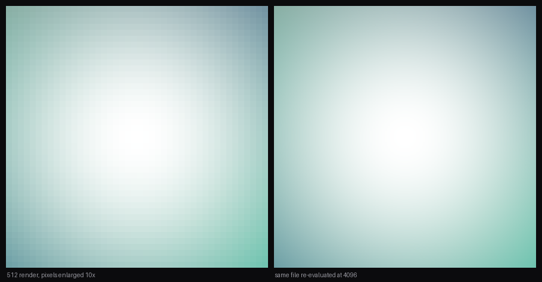
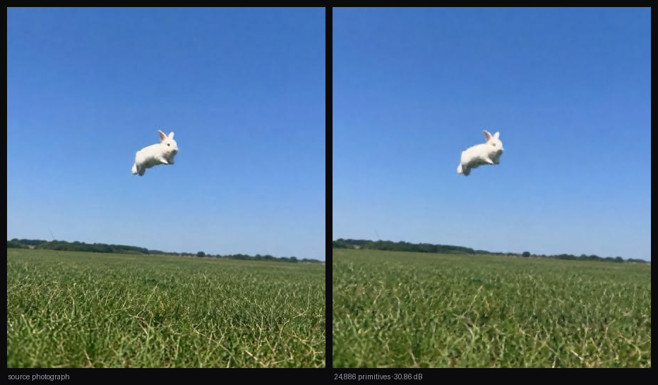
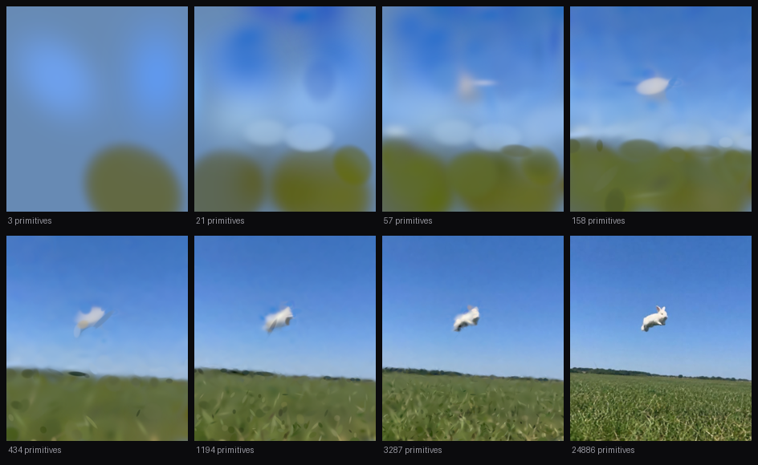
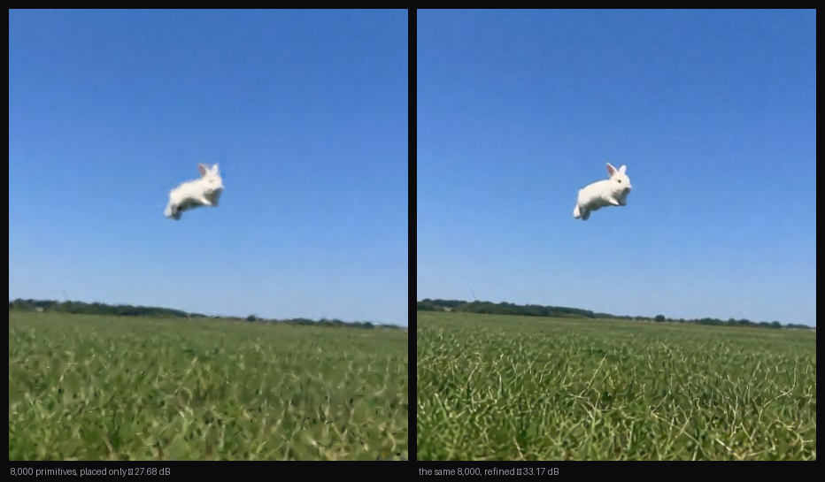
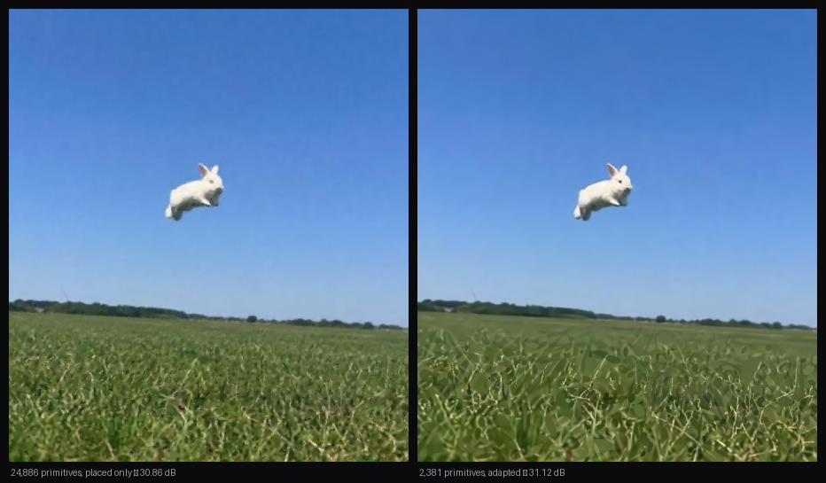
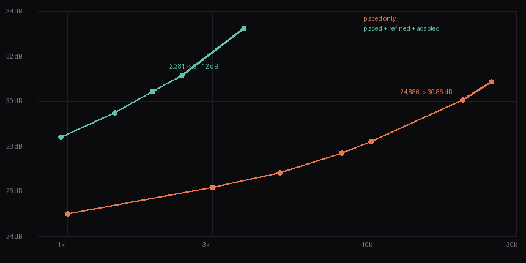

# neo

An engine that reads an image and writes down the math that draws it.

Not a copy of the image — a set of numbers and a rule for evaluating them, from
which the image can be reconstructed at any resolution, on any machine, without
the original ever being present.

## The idea

Everything on a screen is pixels. But pixels are a *sampling* of something, not
the thing itself. If you can recover the continuous description underneath —
the shapes, their extents, their colours — then the pixels become one possible
rendering of it rather than the substance of it.

The test for whether you have actually recovered a description, rather than
merely compressed a picture, is simple: **fit at one resolution, render at
another, and see whether real detail appears.** A compressed picture cannot do
this. It has nothing to draw on. A description can, because it was never made
of pixels in the first place.

A video is then a sequence of such descriptions — and the interesting claim is
that consecutive frames should share most of their primitives, with motion
appearing as those primitives' parameters changing smoothly over time. Movement
stops being a difference between two grids of numbers and becomes a small
function of `t`.

That is the direction. It is being built one verified step at a time, and what
follows is every step that currently works.

Requires a recent Rust toolchain and a GPU with Metal, Vulkan, or DX12.

```bash
cd mathset && cargo build --release
```

---

## 1 · An image made of forty-five numbers

**2026-07-26**

[`sets/five.mathset`](mathset/sets/five.mathset) is a text file containing five
rows of nine numbers. Open it — the whole thing fits on a screen. It is the
entire image.

```bash
cd mathset && cargo run --release -- render sets/five.mathset out.png
```


Each row is one soft ellipse:

```
x     y     sx    sy    theta       r     g     b     a
0.38  0.42  0.220 0.045 -0.5235988  0.95  0.55  0.15  0.85
```

Where it is, how long and how thin, how tilted, what colour, how opaque. That
row is the orange stroke.

Worth doing: change a number and re-render. Set `sy` to `0.15` and the stroke
fattens. Set `theta` to `0` and it lies flat. Move the last row to the top of
the list and the white dot vanishes behind the blue — because the list is a
paint order, not a set.

**The decoder never sees a source image.** There is nothing to copy from. The
picture is computed from those forty-five numbers and nothing else.

---

## 2 · The numbers have no resolution

**2026-07-26**

Same file. Render it eight times larger:

```bash
cd mathset && cargo run --release -- render sets/five.mathset big.png --scale 8
```

4096×4096. Zoom all the way into any edge — it is clean.



Left is the honest limit of a picture: the 512 render with its pixels blown up
ten times. Right is the same region of the same file, evaluated at 4096. The
curve on the right was never stored anywhere.

Nothing was upscaled or interpolated. There was no 512×512 image to enlarge;
there were five equations, and they were evaluated at sixty-four times as many
points. The detail at 4096 is not invented and not smoothed — it was always
implied by the numbers and simply not resolved before.

A compressed image cannot do this. It has nothing to draw on. This is the
difference between a picture *of* something and a description *of* something.

To confirm it is not an illusion, the 8× render can be shrunk back down and
compared against a native 512×512 render:

```
8x downsampled back and compared: 60.86 dB
```

The same description, sampled at two densities, agreeing.

---

## 3 · One number from soft to hard

**2026-07-26**

A Gaussian cannot make an edge — its falloff is smooth everywhere. Real images
are full of edges, so the primitive carries a shape exponent `β` that controls
how abruptly it ends.

```bash
cd mathset && cargo run --release -- render sets/beta.mathset out.png --scale 3
```


Five primitives, identical in position, size, and colour. Only `β` differs —
`0.5, 1, 2, 4, 12` from left to right. They run from a long-tailed blur through
an ordinary Gaussian to a nearly hard-edged disc: a **13× sharper** transition
across that range, for one extra number per primitive.

Note how far the leftmost one reaches — at `β = 0.5` the tails extend twelve
standard deviations and visibly wash into its neighbour. That is the cost of a
soft primitive, and the reason `β < 1` is rarely the right tool. Detail should
come from more primitives, not longer tails.

The point is not that hard edges are better. It is that the fitter gets to
choose, per primitive, so soft skin and a crisp sleeve cost exactly the same.

---

## 4 · The image is a consequence of the file

**2026-07-26**

A renderer producing a plausible picture proves very little. So there are two
decoders, sharing no code:

- Rust and WGSL, running `f32` on the GPU, with hardware blending
- Python standard library, running `f64` on the CPU, written from the written
  spec alone

```bash
./mathset/tools/verify.sh
```

```
── sets/five.mathset
    max channel difference : 2 / 255
    psnr                   : 56.05 dB

── sets/beta.mathset
    max channel difference : 1 / 255
    psnr                   : 57.66 dB
```

Different language, different precision, different hardware, different blending
path — same image, to within a rounding error of one or two parts in 255.

That agreement is the real claim. The picture is not an artifact of a
particular renderer or a particular machine. It is a consequence of the
numbers, and anyone with the file can recompute it.

There is no image for this section on purpose. Two matching pictures would
prove less than the numbers do.

---

## 5 · A photograph, written down as math

**2026-07-26**

The first four sections used sets written by hand. This one is read off a real
photograph.

```bash
cd mathset && cargo run --release -- fit ../assets/whiterabbit.jpg out.mathset --preview out.png
```

3.4 seconds. **24,886 primitives, 30.86 dB.**



That number is measured the hard way: the emitted file is reloaded from disk
and decoded by the ordinary decoder — the one that has never seen the
photograph — and *that* is compared against the source. Nothing the fitter
believes about its own canvas is taken on trust.

Open the output. It is the same format as the five-line file in section 1,
just longer. Every row is still nine or ten numbers describing one ellipse,
still in normalized coordinates, still with no pixel anywhere in it. Which
means:

```bash
cd mathset && cargo run --release -- render out.mathset big.png --scale 4
```

The photograph now renders at 1804×2044 — four times the resolution it was
fitted at. Not upscaled. The primitives were re-evaluated at the finer
sampling, and edges that were two pixels wide in the source are now smooth
curves, because in the description they were never pixels at all.


The kept fits and their numbers live in [fits/](fits/).

**What is honestly wrong with this result:** 24,886 primitives for 230,461
pixels is one primitive per nine pixels. That is too dense to call a
description of the image. The cause is structural — greedy placement can never
adjust a primitive after placing it, so the only way to fix an error is to
stack another primitive over it, and the count inflates without the
description improving. See
[docs/fitting.md](docs/fitting.md#the-honest-limitation).

The number to watch is not the dB but the dB *per primitive* — which is what
section 7 goes after.

---

## 6 · Watching it assemble

**2026-07-26**

The set is an *ordered* sequence — first primitive painted first. Which means
every prefix of the file is itself a complete, valid set. Drawing the first
three primitives is not a partial render; it is a whole, smaller description.

```bash
cd mathset && cargo run --release -- render out.mathset build.png --steps 40
```



Forty frames, from a handful of ellipses to the finished image, spaced
geometrically because the first few primitives carry far more of the picture
than the last few thousand. A single frame at any depth:

```bash
cd mathset && cargo run --release -- render out.mathset one.png --limit 60
```

Sixty rows in, the photograph is already recognisable. That is the clearest
statement of what a math set is: not a compressed picture, but a description
that is *complete at every length*, and merely gets more specific.

---

## 7 · Moving the primitives instead of adding more

**2026-07-26**

Section 5 ended with a complaint: 24,886 primitives for 230,461 pixels is too
dense to call a description. The cause was that greedy placement can never
adjust a primitive once it is down, so its only way to fix an error is to
stack another one on top.

Every parameter of the primitive is differentiable — position, extents,
rotation, colour, opacity, and `β`. So instead of adding primitives, move the
ones that already exist:

```bash
cd mathset && cargo run --release -- refine ../assets/whiterabbit.jpg in.mathset out.mathset --iters 900
```

Nothing is added or removed. The same rows, with better numbers in them.



Identical count, **+5.5 dB**. And the result that actually matters:


**6.2× fewer primitives for the same image** — one per 58 pixels instead of
one per 9. The file goes from 2.1 MB to 358 KB, but the size is a side effect.
The point is that the set has stopped patching itself and started describing
something.

The derivatives are closed form — about eighty lines of WGSL, no automatic
differentiation. The awkward part is that a primitive's influence on the final
image is scaled by everything painted *over* it, `Π(1−α)`, which is only known
after the later primitives are seen. That forces a backward walk through the
composite. [docs/refining.md](docs/refining.md) has the full chain.

**A wrong gradient is the quietest possible bug** — the image still improves,
because the other nine parameters compensate, so no fidelity number would ever
reveal it. Every derivative is therefore checked against a central finite
difference of the same forward model, implemented separately in `f64` on the
CPU:

```bash
cd mathset && cargo run --release -- gradcheck ../assets/whiterabbit.jpg tiny.mathset
```

```
 param         analytic      finite diff    rel err
     x        -246.8766        -245.3877    0.00603
 theta          15.6117          15.8483    0.01493
  beta          88.3083          88.5451    0.00267
       ...  worst relative error 0.02316 — gradients agree
```

**What is still wrong:** the count is fixed. Refinement cannot add a primitive
where the image needs one, or delete one that has become useless. That is what
section 8 goes after.

---

## 8 · How few is enough

**2026-07-26**

Refinement can move the primitives that exist but not change how many there
are. It cannot add one where the image needs it, and it cannot drop one that
has become useless. Both are available for almost nothing, because the
backward walk already knows what every primitive is worth.

Removing a primitive shifts the image by a quantity the walk already computes,
so the exact loss it earns its place with falls out with no extra pass:

```
dC     = T_k · a_k · ( c_k - C_{k-1} )
worth  = dot(dC, dC) - dot(dC, dL/dC_N)
```

Positive means it pays for itself. Zero means it contributes nothing. Negative
means removing it would *improve* the image. And a primitive whose accumulated
positional gradient is large is being pulled in conflicting directions — one
primitive asked to cover two things — so it splits in two.

```bash
cd mathset && cargo run --release -- refine ../assets/whiterabbit.jpg in.mathset out.mathset \
  --iters 900 --adapt --count 2500
```



**10.5× fewer primitives than placement alone, for a slightly better image.**

| | primitives | round trip | pixels per primitive |
|---|---:|---:|---:|
| placed only | 24,886 | 30.86 dB | 9 |
| placed + refined | 4,000 | 30.99 dB | 58 |
| **placed + refined + adapted** | **2,381** | **31.12 dB** | **97** |



The worth score is checked against reality the same way the gradients are —
predicted loss increase against the loss actually measured after removing the
primitive. Worst relative error **0.1%** across four orders of magnitude. It is
exact, not a heuristic that happens to work.

This matters more than the fidelity. A set with a primitive every nine pixels
is pixels in disguise: it would reconstruct perfectly and be useless for
everything downstream, because nothing in it corresponds to anything in the
image. A primitive every 97 pixels is starting to be a description — and
whether these primitives are stable enough to *persist* from one frame to the
next is the question the whole project turns on.

**What is still missing:** splitting is the only way to add. A primitive can
divide, but nothing introduces one into a region that has none, so anything
placement missed entirely stays missed.
[docs/parsimony.md](docs/parsimony.md) has the method and the failure modes.

---

## The math

Everything above rests on one formula and one compositing rule. Both are short
enough to state here in full. [docs/math.md](docs/math.md) carries the
derivations.

### The primitive

A **primitive** is an ellipse with a soft edge. It has its own coordinate
frame, rotated by `θ` and scaled by `σx` and `σy`, and a point is measured in
that frame in units of standard deviations:

```
d = p − μ                            offset from the primitive's centre

u = (  d.x·cos θ + d.y·sin θ ) / σx
v = ( −d.x·sin θ + d.y·cos θ ) / σy
```

Undoing the rotation and dividing by the extents turns an ellipse in canvas
space into a circle in `(u, v)` space. The primitive's value there depends only
on distance from its centre:

```
G(u, v) = exp( −½ · (u² + v²)^β )
```

- `β = 1` is an ordinary **Gaussian** — the bell curve. Smooth everywhere,
  and therefore unable to produce a hard edge.
- `β > 1` squares the edge off. `β = 12` gives a transition **13× narrower**
  than a Gaussian's, approaching a hard-edged disc.
- `β < 1` gives longer tails than a Gaussian. Expensive, and rarely useful.

For `β = 1` this is the familiar multivariate Gaussian written differently.
With the **covariance matrix** `Σ = R(θ)·diag(σx², σy²)·R(θ)ᵀ`, it happens
that `u² + v² = dᵀΣ⁻¹d`, so `G(p) = exp(−½ dᵀΣ⁻¹d)`. The file stores
`(σx, σy, θ)` instead of `Σ` because each of those three numbers means
something on its own, and keeping the extents positive is a bound on one
number rather than a constraint on a matrix.

### Compositing

Each primitive's **opacity** at a point is its peak opacity `a` scaled by the
falloff, and primitives are laid down in file order with the standard *over*
operator:

```
α  = a · G(u, v)

C₀ = background
Cₖ = αₖ · cₖ + (1 − αₖ) · Cₖ₋₁
```

This does not commute — swapping two overlapping primitives changes the
result. That is why the file stores a **sequence**, not a set, and why
section 6 works at all.

### Colour

Colours are **stored** sRGB-encoded and **composited in linear light**.

*Linear light* means values proportional to actual photons; *sRGB* is the
non-linear encoding your screen and every image file use, which spends more
precision on darks because eyes do. Blending is only physically correct in
linear light, but a file should be legible, so the conversion happens at the
boundary:

```
srgb → linear:   c ≤ 0.04045   ?  c / 12.92  :  ((c + 0.055) / 1.055)^2.4
linear → srgb:   c ≤ 0.0031308 ?  12.92 · c  :  1.055 · c^(1/2.4) − 0.055
```

### The envelope

A Gaussian never reaches zero, so drawing has to stop somewhere. The cutoff is
derived rather than picked: draw the primitive only where it could still change
an 8-bit output, which is where it exceeds half a code value, `ε = 1/510`.

```
exp(−½ r^{2β}) ≥ ε    ⟹    r ≤ (−2 ln ε)^{1/2β}  ≈  12.4688^{1/2β}
```

For `β = 1` that is 3.53σ; for `β = 12`, 1.11σ. A sharper primitive gets a
tighter footprint automatically.

### Coordinates

Positions and extents are **normalized** against the long edge of the
reference canvas, so a 1200×260 image spans `x ∈ [0,1]`, `y ∈ [0,0.217]`.
Nothing in the file refers to a pixel. To render at `W × H`, pick a scale
`unit` in pixels per normalized unit; pixel `(i, j)` then samples the
description at `((i+0.5)/unit, (j+0.5)/unit)`. Doubling the output resolution
doubles `unit`, and every fragment re-evaluates `G` — which is the whole of
section 2.

### Reading the numbers

Fidelity is quoted as **PSNR** in decibels — peak signal-to-noise ratio, over
the 0–255 sRGB channels:

```
MSE  = mean over all pixels and channels of (a − b)²
PSNR = 10 · log₁₀( 255² / MSE )
```

It is a logarithmic scale: **+6 dB halves the RMS error**, +3 dB halves the
mean squared error. Rough
guide for what a figure means:

| PSNR | what it looks like |
|---|---|
| ~20 dB | obviously wrong |
| ~30 dB | recognisable, visibly soft — where the fitter is today |
| ~40 dB | hard to tell from the source at normal viewing |
| 50 dB+ | differences are rounding, not content |

Two figures appear throughout and they measure different things. The **round
trip** compares a decoded `.mathset` against the *source photograph* — how good
the description is. **Conformance** compares two decoders against *each other*
on the same file — whether the image is a property of the file rather than of a
renderer. The first is 30.86 dB and improving; the second is 56–62 dB and is
supposed to stay there.

### Glossary

| term | meaning |
|---|---|
| **math set** | a `.mathset` file: a complete description of an image as numbers plus a rule |
| **primitive** | one entry — one soft ellipse. Called `splats` in the file, for the technique it comes from |
| **σ** (`sx`, `sy`) | standard deviation: the primitive's extent along its own axes, before rotation |
| **θ** (`theta`) | rotation of the primitive's own axes, in radians |
| **β** (`beta`) | shape exponent — how abruptly the edge falls. 1 is a Gaussian |
| **α** (`a`) | opacity at the centre, before the falloff is applied |
| **envelope** | how far out a primitive is worth drawing, in σ |
| **paint order** | the file's order, which is the composite order, which is not reorderable |
| **greedy placement** | the fitter's method: propose, keep what improves, never revisit |
| **refinement** | gradient descent on the parameters of primitives that already exist |
| **worth** | the exact loss increase that removing a primitive would cause |
| **transmittance** | `Π(1−α)` for everything painted over a primitive — how much of it still shows |
| **round trip** | fit → save → reload → decode → compare against the source |
| **decoder** | reads a set and paints it. Never sees a source image |

---

## Where it stands

| stage | state |
|---|---|
| `.mathset` format | defined |
| decoder — math in, image out | working, cross-verified |
| fitter — image in, math out | working |
| gradient refinement | working |
| splitting and pruning | working, 10.5x fewer primitives at equal fidelity |
| two-frame persistence | **next — the real test** |
| temporal curves | not started |

The two-frame stage is the real test of the thesis. Everything before it is
groundwork. See [docs/roadmap.md](docs/roadmap.md) for what each stage is meant
to prove, and what would count as it failing.

## Documentation

- [docs/format.md](docs/format.md) — the `.mathset` file, normatively
- [docs/math.md](docs/math.md) — the primitive, compositing, colour, and the derivations
- [docs/fitting.md](docs/fitting.md) — how an image becomes a set, and what was measured
- [docs/refining.md](docs/refining.md) — the gradients, and how they are checked
- [docs/parsimony.md](docs/parsimony.md) — what a primitive is worth, and how few are needed
- [docs/verification.md](docs/verification.md) — how correctness is established
- [docs/roadmap.md](docs/roadmap.md) — the staged plan and what each stage proves
- [fits/LOG.md](fits/LOG.md) — kept fits, their settings and their numbers

## Layout

```
mathset/
  src/format.rs        the spec in code — parsing and validation
  src/splat.wgsl       the decoder — evaluates the primitive, composites
  src/render.rs        GPU setup, offscreen target, readback
  src/fit.wgsl         propose, score, reduce
  src/fit.rs           the fitting loop
  src/refine.wgsl      the backward pass — analytic gradients
  src/refine.rs        binning, Adam, the CPU-side forward for checking
  sets/                hand-written .mathset files
  tools/reference.py   independent CPU implementation, for cross-checking
  tools/verify.sh      build and check everything
assets/                test images
fits/                  kept fits, with the log of what produced them
docs/
```
