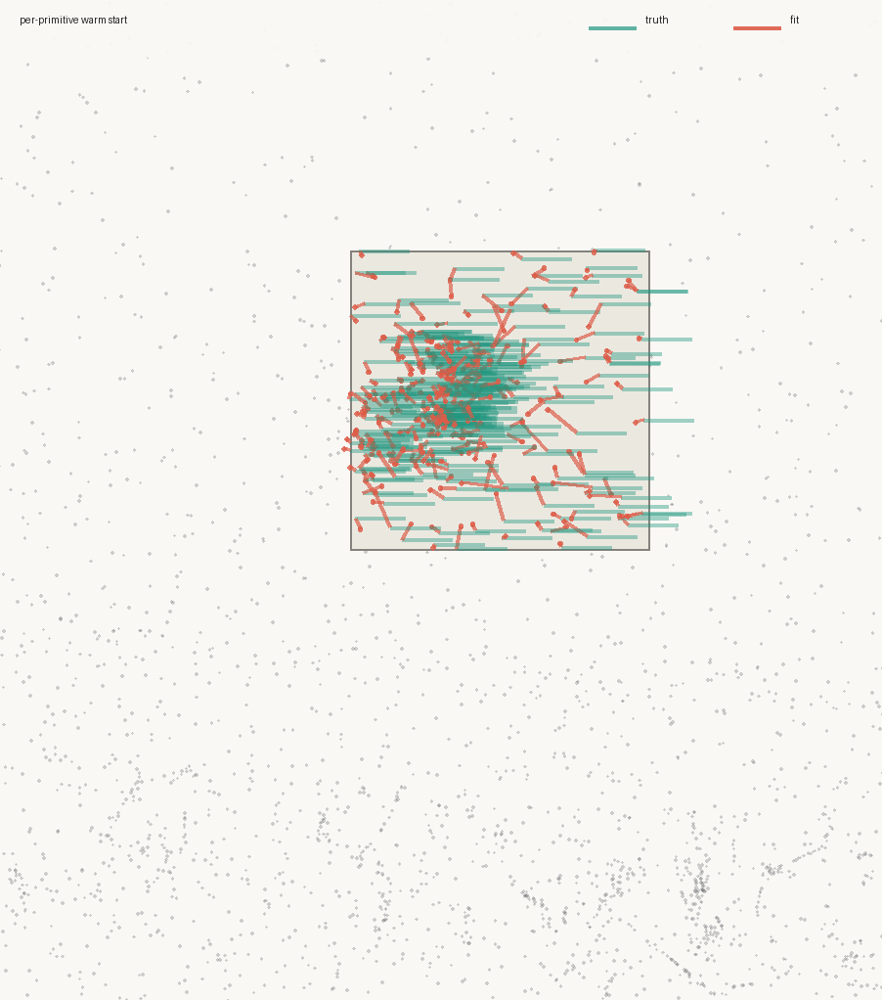
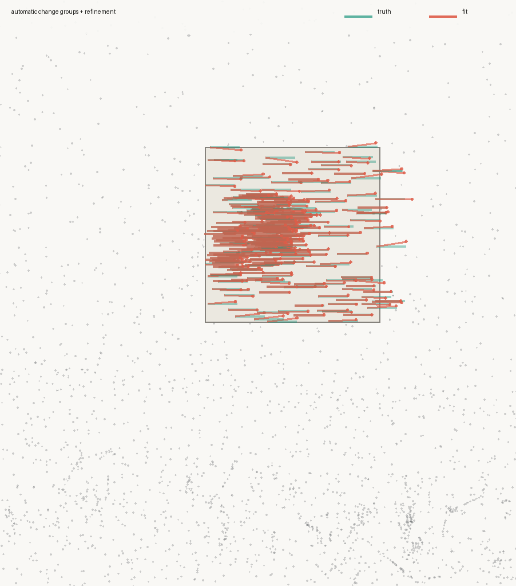

# Two-frame persistence

Stage 5 asks the first question that matters for movement: can the same
primitives carry identity from one frame to the next?

Image fidelity cannot answer it. A fit can reconstruct frame B perfectly by
leaving every primitive in place and changing its colour. The result looks
right and contains no recovered motion. This stage is therefore developed
against synthetic motion with an exact displacement field, never against
footage that can only be judged by eye.

## The harness

`warp.py` makes frame B from frame A and records the transformation:

```bash
cd mathset
python3 tools/warp.py ../assets/whiterabbit.jpg target/mo \
  --patch 0.35,0.25,0.30,0.30 --shift 0.05,0.0
```

It writes `a.png`, `b.png`, and `truth.json`. The patch and shift are normalized
against the long canvas edge, like primitive coordinates.

Fit and adapt frame A, then warm-start the same ordered set onto B:

```bash
cargo run --release -- fit target/mo/a.png target/mo/A0.mathset --budget 2500
cargo run --release -- refine target/mo/a.png target/mo/A0.mathset \
  target/mo/A.mathset --iters 600 --adapt --count 2500
cargo run --release -- refine target/mo/b.png target/mo/A.mathset \
  target/mo/B-warm.mathset --iters 400
python3 tools/persist.py target/mo/A.mathset target/mo/B-warm.mathset \
  target/mo/truth.json
```

`persist.py` compares rows by order and reports displacement accuracy inside
and outside the moved region. It can also make the motion field visible:

```bash
python3 tools/persist.py target/mo/A.mathset target/mo/B-warm.mathset \
  target/mo/truth.json --plot target/mo/warm.png
```

## The negative result

Frame A has 2,381 primitives and reconstructs at 30.52 dB. Warm-started
refinement of frame B begins at 26.05 dB and reaches **30.90 dB** after 400
iterations, with the same primitive count. Fidelity says success.

Displacement says failure:

| true shift | mean displacement inside patch | median position error |
|---:|---:|---:|
| 2.0 px | +1.25 px | 0.89 px |
| 5.1 px | +1.77 px | 3.72 px |
| 10.2 px | +0.88 px | 9.42 px |
| 20.4 px | +0.29 px | 20.16 px |
| 25.6 px | −0.36 px | 25.69 px |

At 25.6 px only 20 of 295 primitives in the patch — **6.8%** — register as
moved. Outside the patch, median drift is only 0.78 px, so the machinery is not
globally unstable. The moved primitives found a nearer minimum: keep position,
change appearance.



## Why it fails

Inside the moved patch, geometric-mean `σ` is 2.29 px at the 10th percentile,
3.27 px at the 25th, and 5.13 px at the median. A position derivative is
supported only where the primitive is supported. Once its content moves
farther away, no gradient points from the old location to the new one.

The shift sweep puts that capture radius at roughly 2–3 px. Tracking works at
2 px, becomes partial at 5 px, and is effectively absent by 10 px. This is the
classic large-motion problem.

Recolouring is not an optimizer bug. It is the correct local answer to the
objective the optimizer was given.

## A plain pyramid does not rescue it

`refine --max-side N` runs the same set and target at a smaller working
resolution, which makes the simplest 1/8→1/4→1/2→full experiment explicit:

```bash
cargo run --release -- refine target/mo/b.png target/mo/A.mathset \
  target/mo/P64.mathset --max-side 64 --iters 400
cargo run --release -- refine target/mo/b.png target/mo/P64.mathset \
  target/mo/P128.mathset --max-side 128 --iters 300
cargo run --release -- refine target/mo/b.png target/mo/P128.mathset \
  target/mo/P256.mathset --max-side 256 --iters 200
cargo run --release -- refine target/mo/b.png target/mo/P256.mathset \
  target/mo/P511.mathset --iters 200
```

At 1/8 resolution it reaches 51.18 dB while recovering only +0.04 px of motion;
just 0.7% of the moved primitives register as moved. The full chain ends at
30.88 dB, but moved-region displacement is only +0.78 px and median error is
25.16 px. Only 9.8% register as moved.

The reason is geometric. Coordinates and extents are normalized, so at pyramid
scale `s` both displacement and primitive extent become:

```text
shift_px' = s · shift_px
sigma_px' = s · sigma_px
```

Their ratio does not change. Downsampling makes the numerical shift smaller
without enlarging the primitive's basin relative to it. Inflating individual
supports by 2×–16× was also tested; it produced scattered movement and 10–36%
false positives outside the patch, not coherent translation.

This negative closes the cheap path. A coarse search must act on something
larger than one primitive.

## A group crosses the basin

`track-group` accepts a rectangle that defines group membership, then searches
a rigid 2D translation against frame B at coarse resolution. It does not read
the ground-truth shift.

```bash
cargo run --release -- track-group target/mo/b.png target/mo/A.mathset \
  target/mo/grouped.mathset \
  --rect 0.35,0.25,0.30,0.30 --range 0.10 --levels 6 --max-side 128
```

For the 25.55 px test it finds **+26.35 px** in 0.1 s. Before any gradient
refinement, all 295 supplied members move, median error is 0.80 px, and no
outside primitive moves. After 200 ordinary refinement iterations:

| measurement | result |
|---|---:|
| reconstruction | 30.82 dB |
| mean moved-region displacement | +25.90, +0.11 px |
| median moved-region error | 0.84 px |
| moved members recovered | 295 / 295 |
| outside false positives | 4 / 2,086 (0.2%) |

The same search was checked across the original capture-radius sweep and a
diagonal move:

| true movement | recovered movement | median error |
|---:|---:|---:|
| +2.04, 0.00 px | +2.40, 0.00 px | 0.35 px |
| +5.11, 0.00 px | +5.19, +0.40 px | 0.41 px |
| +10.22, 0.00 px | +10.38, 0.00 px | 0.16 px |
| +25.55, 0.00 px | +26.35, 0.00 px | 0.80 px |
| +20.44, +10.22 px | +19.96, +9.98 px | 0.54 px |

## Discovering groups from the frame pair

The rectangle above isolates the mechanism but supplies membership.
`track-change` removes that input:

```bash
cargo run --release -- track-change target/mo/a.png target/mo/b.png \
  target/mo/A.mathset target/mo/grouped.mathset \
  --threshold 2 --range 0.10 --levels 7 --max-side 128
```

It compares the actual A and B frames at 128 px and marks pixels whose maximum
channel difference is at least two 8-bit codes. Changed pixels join through
8-connected 8 px cells so texture holes remain one surface while spatially
separate regions remain separate. Within each component, sub-pixel frame
correspondence finds where A's pixels appear in B; that translation is then
applied to the component's primitives. It does not read `truth.json`, and the
imperfect primitive reconstruction is no longer asked to judge its own motion.

On the 25.55 px case, the inferred region selects 314 primitives: all 295 true
members plus 19 boundary extras caused by the downsampled change support. Frame
correspondence finds +25.95 px. Before refinement, median error is 0.40 px and
outside false positives are 19 / 2,086 (0.9%). After 200 ordinary refinement
iterations:

| measurement | result |
|---|---:|
| reconstruction | 30.81 dB |
| mean moved-region displacement | +25.83, −0.01 px |
| median moved-region error | 0.66 px |
| moved members recovered | 295 / 295 |
| outside false positives | 23 / 2,086 (1.1%) |



Spatially separate motions get separate components and transforms. This
two-motion case is generated and evaluated without one-off code:

```bash
python3 tools/warp.py ../assets/whiterabbit.jpg target/multi \
  --motion 0.10,0.15,0.22,0.22,0.04,0.0 \
  --motion 0.58,0.62,0.20,0.20,-0.03,-0.02
cargo run --release -- track-change target/multi/a.png target/multi/b.png \
  target/mo/A.mathset target/multi/B.mathset \
  --threshold 2 --range 0.10 --levels 7 --max-side 128
python3 tools/persist.py target/mo/A.mathset target/multi/B.mathset \
  target/multi/truth.json
```

| true movement | recovered movement | median error | recovered members |
|---:|---:|---:|---:|
| +20.44, 0.00 px | +19.96, 0.00 px | 0.48 px | 46 / 46 |
| −15.33, −10.22 px | −14.35, −9.92 px | 1.03 px | 120 / 120 |

Outside false positives are 32 / 2,215 (1.4%) at half the smaller motion
magnitude.

## Kept endpoints and executable transition

The measured mathsets are kept as milestone fits:

| file | meaning |
|---|---|
| [`whiterabbit-20260727-motion-a.mathset`](../fits/whiterabbit-20260727-motion-a.mathset) | frame A, before motion |
| [`whiterabbit-20260727-motion-b.mathset`](../fits/whiterabbit-20260727-motion-b.mathset) | coarse group result; only positions differ from A |
| [`whiterabbit-20260727-motion-b-refined.mathset`](../fits/whiterabbit-20260727-motion-b-refined.mathset) | the measured 30.81 dB refined endpoint |

The coarse A→B pair is the movement result. It keeps every non-position
parameter identical, so each ordered primitive has a linear position function:

```text
p_i(t) = p_i(A) + t · (p_i(B) - p_i(A)),  0 ≤ t ≤ 1
```

The decoder can evaluate that function into another `.mathset` at any `t`:

```bash
cd mathset
cargo run --release -- transition \
  ../fits/whiterabbit-20260727-motion-a.mathset \
  ../fits/whiterabbit-20260727-motion-b.mathset \
  target/motion-075.mathset --t 0.75
cargo run --release -- render target/motion-075.mathset \
  target/motion-075.png
```

The command verifies row identity and rejects an appearance or shape change.
The refined B set is evidence for the final frame, but the pure-position B set
is the endpoint to use for a movement-only transition.

## Rigid rotation

Translation is not enough for a rotating group. A rigid transform must rotate
both each primitive centre around a shared pivot and the primitive's own axes:

```text
p_i(t) = c + R(tφ) · (p_i(A) - c) + t·d
θ_i(t) = θ_i(A) + tφ
```

`track-rigid` searches translation and angle together. The supplied rectangle
defines group membership and pivot only; the command does not read synthetic
truth. It saves both endpoint B and a motion descriptor because A and B alone
do not uniquely state which arc was taken between them.

The exact test uses frame 0 of `assets/wheel.gif`, rotated +12° by `warp.py`:

```bash
cd mathset
magick ../assets/wheel.gif -coalesce target/wheel/frames/frame-%02d.png
python3 tools/warp.py target/wheel/frames/frame-00.png \
  target/wheel/synthetic-rotation \
  --size 512x341 --patch 0.16015625,0.01953125,0.62890625,0.62890625 \
  --shift 0,0 --rotate 12
cargo run --release -- fit target/wheel/synthetic-rotation/a.png \
  target/wheel/A0.mathset --budget 3000 --max-side 512
cargo run --release -- refine target/wheel/synthetic-rotation/a.png \
  target/wheel/A0.mathset target/wheel/A.mathset \
  --iters 600 --adapt --count 2400
cargo run --release -- track-rigid \
  target/wheel/synthetic-rotation/b.png target/wheel/A.mathset \
  target/wheel/B.mathset \
  --rect 0.16015625,0.01953125,0.62890625,0.62890625 \
  --motion target/wheel/wheel.motion.json \
  --range 0.02 --angle-range 18 --levels 9 --max-side 512
python3 tools/persist.py target/wheel/A.mathset target/wheel/B.mathset \
  target/wheel/synthetic-rotation/truth.json
```

The 2,285-primitive A set reconstructs the source at 40.02 dB. Of those,
2,196 centres lie inside the wheel rectangle. The search recovers +11.988°
with zero translation. Median position error is 0.02 px, the 90th percentile
is 0.03 px, median orientation error is 0.012°, and all 89 outside primitives
remain exactly still.

At this resolution the native search matters. A 128 px search found the right
angle but introduced a 0.88 px translation that improved the downsampled
score while hurting the native thin spokes. Re-running at `--max-side 512`
removed that alias. The resolution used to judge a transform must resolve the
features that constrain it.

The saved transition is executable:

```bash
cargo run --release -- transition \
  ../fits/wheel-20260727-rigid-a.mathset \
  ../fits/wheel-20260727-rigid-b.mathset \
  target/wheel-half.mathset --t 0.5 \
  --motion ../fits/wheel-20260727-rigid.motion.json
```

`transition` validates that applying the descriptor at `t=1` reproduces the
supplied B endpoint. It rejects a mismatched descriptor rather than silently
drawing a different path.

### Why rigid-only was rejected for the real GIF

Independent native-resolution rigid fits from A recover angles between
−0.738° and +0.984°, plus at most a few pixels of frame drift. Across frames
1–12, rigid motion improves the fixed-A reconstruction from 29.76 to 30.96 dB
on average. The number improves, but the rendering is still a nearly static
crisp wheel. It does not reproduce the supplied animation and is not an
acceptable result.

The visible movement includes changing darkness, radial smear, and local spoke
shape. Those changes must be represented rather than discarded as residual.

## Persistent timeline for the real wheel GIF

Frame 0 is represented by 2,285 primitives at 40.02 dB. Each following real
frame is then refined from the immediately preceding mathset for 100 iterations
at native 512×341 resolution. Position and orientation learning rates are
reduced to one quarter of their defaults; extent, colour, opacity, and edge
softness remain unconstrained. Adaptation is disabled: no primitive is added,
removed, or reordered.

```bash
cd mathset
cp target/wheel/A.mathset target/wheel/actual-sequence/frame-00.mathset
for i in $(seq 1 12); do
  n=$(printf '%02d' "$i")
  prev=$(printf '%02d' "$((i-1))")
  cargo run --release -- refine "target/wheel/frames/frame-$n.png" \
    "target/wheel/actual-sequence/frame-$prev.mathset" \
    "target/wheel/actual-sequence/frame-$n.mathset" \
    --iters 100 --max-side 512 \
    --lr-pos 0.00005 --lr-rot 0.002
done
```

Every reported number reloads and decodes the emitted file:

| frame | decoded fidelity |
|---:|---:|
| 0 | 40.02 dB |
| 1 | 38.76 dB |
| 2 | 38.54 dB |
| 3 | 38.92 dB |
| 4 | 38.16 dB |
| 5 | 39.35 dB |
| 6 | 40.33 dB |
| 7 | 40.00 dB |
| 8 | 40.04 dB |
| 9 | 41.31 dB |
| 10 | 41.35 dB |
| 11 | 39.77 dB |
| 12 | 39.90 dB |

Mean fidelity is 39.73 dB and the worst frame is 38.16 dB. Median
frame-to-frame position change stays between 0.57 and 0.68 px; the 90th
percentile stays between 1.32 and 1.47 px. Across the full clip the accumulated
median position change is 2.38 px. A default-learning-rate run scored 0.57 dB
higher on average but doubled accumulated drift and allowed individual
primitives to wander almost 19 px by frame 4. The constrained path is kept
because temporal identity matters more than a small still-frame score.

The durable states are in `fits/wheel-20260727-real/`. Its `timeline.json`
records the 12.5 fps ordering. Sample it at any normalized `t`:

```bash
cargo run --release -- sample-timeline \
  ../fits/wheel-20260727-real/timeline.json \
  target/wheel-at-t.mathset --t 0.541666667
cargo run --release -- render \
  target/wheel-at-t.mathset target/wheel-at-t.png
```

For consecutive keyframes, `sample-timeline` uses:

- linear position and opacity;
- the shortest path for orientation;
- geometric interpolation for positive extents and `β`;
- linear-light interpolation for colour.

This is an explicit parameter transition, not an image cross-fade. It also is
not yet a compact temporal curve: all 13 keyframes are retained. The next
temporal question is how many spline knots reproduce those trajectories
without losing the visible animation.

## What this establishes — and what it does not

The experiment establishes the mechanism:

- independent primitives cannot cross a large-motion basin;
- one coarse translation can carry hundreds of primitives across it;
- ordinary refinement preserves their identity once they arrive;
- spatially separate changed regions and their shifts can be recovered from the
  two images without consulting truth.
- a known group can recover rigid rotation and replay it along circular arcs,
  including each primitive's own orientation.
- one ordered 2,285-row set can persist through the supplied 13-frame wheel
  animation while reconstructing every decoded frame at 38.16–41.35 dB.

It does **not** infer rotating membership automatically, resolve touching
objects with different motion, or reduce the real wheel trajectory to compact
curves. Stage 5 therefore remains in progress. The next geometric tasks are
splitting a connected change component where local correspondence disagrees
and attaching rigid estimation to automatically inferred groups. The wheel's
next task is curve fitting with held-out-frame error, not another still-image
fit.

Keep developing this against generated motion. On real footage a plausible
answer and a correct one are still indistinguishable by eye.
