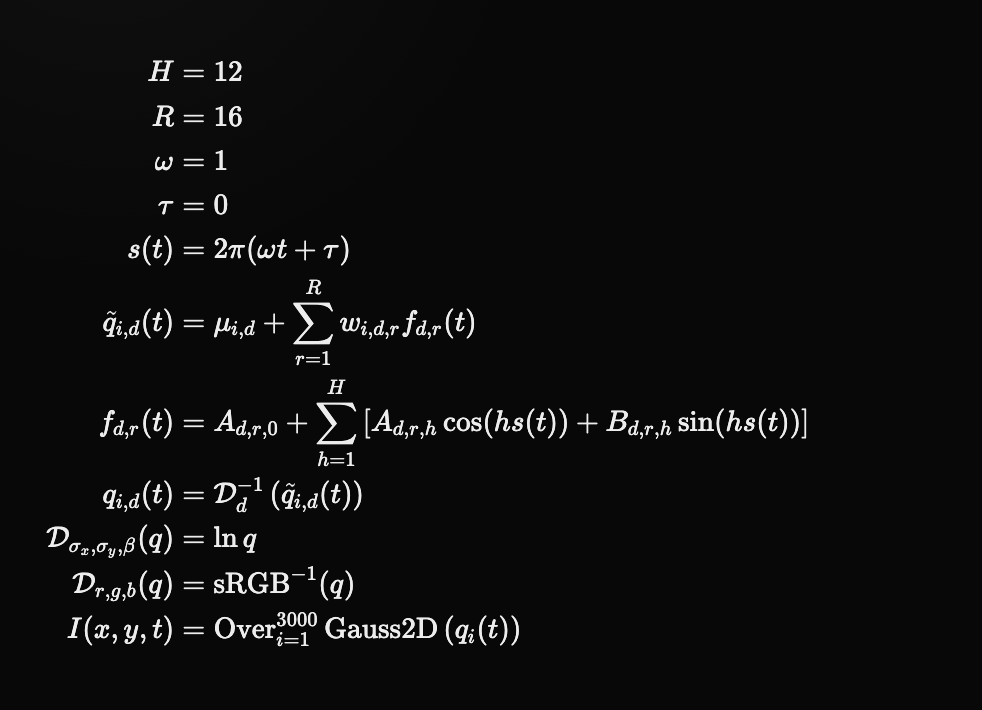
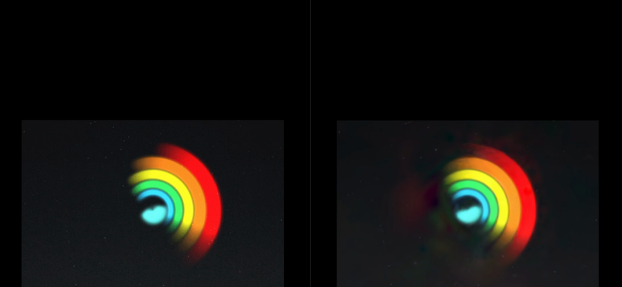

# Temporal curves

How a recovered keyframe timeline becomes one closed-form function of `t`, what
that is worth, and what it does not yet establish.

Read [motion.md](motion.md) first. This document assumes a sequence of
`.mathset` states that already share one ordered primitive identity — same
count, same rows, same order, only parameter values differing. Producing that
sequence is stage 5; turning it into a formula is stage 6.

---

## The problem

[motion.md](motion.md) ends with 13 stored states for a 13-frame GIF. That is a
persistent description, but it is still a table. Nothing in it says the wheel
turns; the turning is implicit in the differences between adjacent rows, and
reading a value at a time between two stored states means interpolating.

Stage 6 asks whether those states are samples of something smooth. If they are,
the table can be replaced by a function, and the animation becomes one
description with time in it rather than a sequence of descriptions.

## The program

Every primitive parameter becomes a function of `t`. The readable evaluator is:



That typeset expression defines how to evaluate the model, but it is not the
whole payload. A self-contained recovered model also carries every value of
`μ`, `w`, `A`, and `B`, plus its canvas and timing metadata. The playground's
`Copy model` action appends those arrays in a versioned capsule; without them,
the equation describes a family of visuals rather than this particular clip.

In text, with `d` indexing the ten parameters of a primitive
(`x`, `y`, `σx`, `σy`, `θ`, `r`, `g`, `b`, `α`, `β`) and `i` indexing
primitives:

```
s(t)       = 2π(ωt + τ)

q̃_{i,d}(t) = μ_{i,d} + Σ_{r=1..R} w_{i,d,r} · f_{d,r}(t)

f_{d,r}(t) = A_{d,r,0} + Σ_{h=1..H} [ A_{d,r,h} cos(h·s(t))
                                    + B_{d,r,h} sin(h·s(t)) ]

q_{i,d}(t) = D_d⁻¹( q̃_{i,d}(t) )

I(x,y,t)   = Over_{i=1..N} Gauss2D( q_i(t) )
```

Two factorisations are stacked, and they do different jobs.

**Low rank across primitives.** For one parameter `d`, the `N` per-primitive
trajectories are not independent — when a wheel turns, thousands of primitives
move in a few coordinated ways. Each parameter gets its own set of `R` shared
modes, and each primitive carries `R` scalar weights `w_{i,d,r}` saying how
much of each mode it follows. `μ_{i,d}` is that primitive's mean value over the
clip. The modes come from an eigendecomposition of the frame-by-frame
covariance of the mean-removed trajectories.

**Fourier across time.** Each mode `f_{d,r}` is a real Fourier series in the
phase `s(t)`, truncated at `H` harmonics. A GIF loops, so the natural basis for
its motion is periodic. `ω` and `τ` are playback controls — rate and offset —
not fitted quantities.

`H` and `R` are the two knobs. `H` is bounded by `floor((frames − 1) / 2)`,
because that is where a Fourier series stops being determined by the samples.
`R` is bounded by `frames − 1`.

## Fitting in the right domain

The fit is not performed on raw parameter values. Three of the ten parameters
are wrong to interpolate linearly, so each parameter is transformed before the
basis is fitted and inverted afterwards — the `D_d` and `D_d⁻¹` in the program:

| parameters | domain | why |
|---|---|---|
| `σx`, `σy`, `β` | `ln q` | strictly positive; a linear fit can cross zero and produce an invalid primitive |
| `r`, `g`, `b` | linear light (`sRGB⁻¹`) | averaging in sRGB darkens mixtures; light adds linearly |
| `θ` | unwrapped angle | orientation is circular, so a raw fit tears at the ±π seam |
| `x`, `y`, `α` | identity | already linear |

This is the same set of domain choices the keyframe sampler in
`mathset/src/timeline.rs` makes between two adjacent states, applied to a whole
trajectory at once instead of a single interval.

## What was measured

Source: the 13-frame `assets/wheel.gif`, through the 13 recovered persistent
states in [`fits/wheel-20260727-real/`](../fits/wheel-20260727-real/) —
2,285 primitives, one ordered identity, published in
[motion.md](motion.md) at 39.73 dB mean.

Every figure below is a decoder render of an evaluated program, scored against
the real GIF frame in sRGB. The decoder is the ordinary `mathset render`; it
never sees the source.

The harness is `scripts/score-formula.mjs`. It imports the TypeScript
extraction and shells out to the release binary, and **both it and the
extraction are untracked**, so these numbers cannot be regenerated from a clean
checkout. Treat them as measurements taken on 2026-07-28, not as a standing
gate. Making them reproducible means item 5 below.

### The formula against the table it replaces

| model | coefficients | relative RMS | mean fidelity | worst frame |
|---|---:|---:|---:|---:|
| 13 stored keyframe states | 296,050 | — | 39.73 dB | 38.16 dB |
| formula, `H`=6 `R`=12 | 298,610 | **0.0000%** | **39.73 dB** | **38.16 dB** |
| formula, `H`=6 `R`=3 | 91,790 | 0.9033% | 35.32 dB | 34.40 dB |
| formula, `H`=6 `R`=1 | 45,830 | 1.3922% | 33.96 dB | 31.64 dB |

At full rank the program is a **near-lossless re-encoding**. Relative RMS in
coefficient space is `3.62 × 10⁻⁸`. Across the 13 decoder renders, 110 of
2,269,696 pixels differ from the stored keyframe renders — 0.0048% — and the
largest RGB-channel difference is 3/255. Both versions have the same 39.73 dB
mean and 38.16 dB worst-frame fidelity against the source at the reported
precision.

Read the first two rows together, though: 298,610 coefficients against 296,050
stored numbers. **At full rank this is not compression.** It is a change of
form — from a table that must be interpolated to a function that can be
evaluated — and the count goes very slightly up. Compression only appears when
`R` is truncated, and then it is paid for in fidelity: rank 3 is 3.2× smaller
and costs 4.4 dB.

`relative RMS` is measured in the transformed coefficient space described
above, over all 2,285 × 10 trajectories at the sampled phases. It is not a
pixel measurement, which is why the fidelity columns are reported beside it.

### Against frames it never saw

The table above scores the program at exactly the times it was fitted to. That
is the easy question. The real one is whether the curve is right *between*
samples.

Fitted on the 7 even-numbered states, scored against the 6 odd-numbered frames
that were withheld:

| harmonics | held-out relative RMS | train fidelity | unseen fidelity | gap |
|---|---:|---:|---:|---:|
| `H`=3 | 7.11% | 37.09 dB | 31.67 dB | **5.42 dB** |
| `H`=2 | 3.51% | 35.05 dB | 33.40 dB | 1.64 dB |
| `H`=1 | 3.91% | — | — | — |

This is an honest negative, and it is the clearest signal in the document.
`H`=3 fits its training frames better than `H`=2 and reconstructs the withheld
ones **worse** — 5.42 dB worse than what it saw, against 1.64 dB for the
smaller model. Larger `H` is buying agreement with the samples by bending
between them.

With 7 training frames, `H`=3 gives 7 Fourier terms for 7 constraints: the
series is exactly determined and has no slack anywhere. That it interpolates
its samples perfectly says nothing about the frames in between, and the
measurement confirms it does not.

So the correct statement of the current result is narrow:

- the program **reproduces every sampled state to decoder precision**, with
  the same source fidelity at the reported precision;
- the program **is not yet established as accurate at unsampled times**, and
  the evidence points the other way when harmonics are pushed.

### The 120-frame source

`assets/giphy.gif` is 120 frames at 600×500 over 3.6 s. It is a local test
source and is not committed to the repository. It is fitted at 32 motion-aware
anchors rather than every frame, and the recovered program is the one
photographed at the top of this document: 3,000 primitives, `H`=12, `R`=16.



It plays convincingly, and the settled poses match closely. The fast-motion
frames show visible streaking that the source does not have — consistent with
the held-out result above, since 88 of those 120 frames are unsampled times.

**Those 88 frames have not been scored.** No fidelity number is claimed for
`giphy.gif` here, and the picture above is an illustration, not a measurement.

## Where the code is

The temporal extraction is **not part of the `mathset` engine.** `mathset/src/`
contains no Fourier or curve-fitting code; the search is in the local
playground, in TypeScript:

- `app/neo/model.ts` — basis extraction, rank truncation, evaluation, and the
  LaTeX rendering of the program;
- `app/neo/extraction.worker.ts` — runs it off the UI thread;
- `app/neo/capsule.ts` — the portable coefficient payload.

Those files are deliberately untracked. Anything that is meant to survive has
to be reimplemented against the Rust engine, and the measurements in this
document were produced by driving the TypeScript extraction and the native
decoder together.

## What would settle it

In rough order of how much each would change the picture:

1. **Score the unsampled frames of a real clip.** The anchor scheme fits 32 of
   120; the other 88 are the actual claim and are currently unmeasured. This is
   the gate.
2. **Choose `H` by held-out error, not by the sample bound.** The current cap
   is `floor((frames − 1) / 2)` — the point where the fit stops being
   determined. The measurement above says the useful `H` is well below that.
3. **Fit the curve against pixels, not against recovered coefficients.** The
   present fit minimises error in coefficient space and inherits whatever the
   per-anchor spatial fits produced. A refinement pass with the loss on the
   rendered frame would let the curve trade one primitive's error against
   another's.
4. **Test a non-periodic clip.** The Fourier basis assumes the motion loops.
   Every source tried so far does.
5. **Move the extraction into `mathset`.** While it lives in an untracked
   playground, none of the numbers above are reproducible from a checkout and
   none of them can be defended by `tools/verify.sh`.
